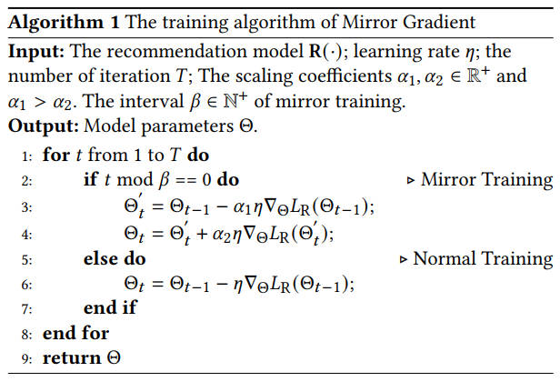
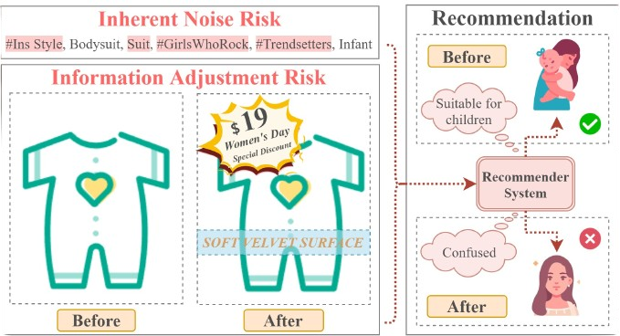

# Mirror Gradient


By [Shanshan Zhong](https://github.com/zhongshsh) and [Zhongzhan Huang](https://dedekinds.github.io) and [Daifeng Li](https://scholar.google.com/citations?user=hbd9SaAAAAAJ&hl=zh-CN) and [Wushao Wen](https://scholar.google.com/citations?user=FSnLWy4AAAAJ) and [Jinghui Qin](https://github.com/QinJinghui) and [Liang Lin](http://www.linliang.net)

This repository is the implementation of "Mirror Gradient: Towards Robust Multimodal Recommender Systems via Exploring Flat Local Minima" [[paper]](https://arxiv.org/abs/2402.11262). Our paper has been accepted at the 2024 ACM Web Conference (WWW 2024).


## 🌻 Introduction

Multimodal recommender systems utilize various types of information, such as texts and images, to model user preferences and item features, helping users discover items aligned with their interests. However, it simultaneously magnifies certain risks from multimodal information inputs, such as **inherent noise risk and information adjustment risk**. To this end, we propose a concise **gradient strategy Mirror Gradient (MG)** that inverses the gradient signs appropriately during training to make the multimodal recommendation models approach flat local minima easier compared to models with normal training. 

<p align="center" style="font-size:6px;">
  
</p>
<!-- <p align="center" style="font-size:6px;">
  
  <br>
  An illustrative example of multimodal risks. Merchants add popular tags (e.g., "ins style") and broad keywords (e.g., "suit") to the text of the bodysuit to increase the likelihood of the item being recommended. At the same time, merchants dynamically change the item's visual features in real-time due to Women's Day marketing campaigns and the emphasis on the superiority of the item's material. These actions make it difficult for the recommender system to accurately determine the target user for the current item, leading to incorrect recommendations for young girls.
</p> -->


## 🌻 Quick Training

As a **general gradient method** of recommender systems, MG can be applied to the training of various recommendation models. The code of this repository is based on [MMRec](https://github.com/enoche/MMRec), a modern multimodal recommendation toolbox, and the core code of MG is in [src/common/trainer.py](src/common/trainer.py#L166-L185). 
We also integrate MG to the modern multimodal recommendation toolbox [MMRec](https://github.com/enoche/MMRec)

(1) Clone the code. 

```sh
git clone https://github.com/Qrange-group/Mirror-Gradient
cd Mirror-Gradient
```

(2) Prepare the enviroment.

```sh
conda env create -f environment.yaml
conda activate mg
pip install torch==2.0.1 torchvision==0.15.2 torchaudio==2.0.2 --index-url https://download.pytorch.org/whl/cu118
pip install --no-index torch_cluster -f https://pytorch-geometric.com/whl/torch-2.0.1+cu118.html
pip install --no-index torch-scatter -f https://pytorch-geometric.com/whl/torch-2.0.1+cu118.html
pip install --no-index torch_sparse -f https://pytorch-geometric.com/whl/torch-2.0.1+cu118.html
pip install --no-index torch_spline_conv -f https://pytorch-geometric.com/whl/torch-2.0.1+cu118.html
pip install torch_geometric
```


(3) Prepare datasets.

See [data](data/README.md). If you want to train models on other Amazon datasets, please see the [processing tutorial](preprocessing/README.md). 

(4) Train the model with MG. 

```sh
cd src 
python main.py
```

You can change the model and dataset by the code,
```sh
python main.py --model DRAGON --dataset sports
python main.py --model LayerGCN --dataset sports
```

If you don't want to use MG during training, please use `--not_mg`. For example, 
```sh
python main.py --not_mg
```

(5) Analyze logs.

The training logs are saved in `src/logs`, and the log file name of models trained with MG has the logo of `mg`. You can run the following code and get the best result of each log file in `src/analysis.txt`. 
```sh
python analysis.py
```

## 🌻 Supported Models and Datasets

- Models: [BM3](https://dl.acm.org/doi/10.1145/3543507.3583251), [DRAGON](https://arxiv.org/abs/2301.12097), [DualGNN](https://ieeexplore.ieee.org/abstract/document/9662655), [FREEDOM](https://arxiv.org/abs/2211.06924), [GRCN](https://arxiv.org/abs/2111.02036), [ItemKNNCBF](https://arxiv.org/abs/1907.06902), [LATTICE](https://arxiv.org/abs/2104.09036), [LayerGCN](https://arxiv.org/abs/2207.11088), [MGCN](https://arxiv.org/abs/2308.03588), [MMGCN](https://staff.ustc.edu.cn/~hexn/papers/mm19-MMGCN.pdf), [MVGAE](https://ieeexplore.ieee.org/abstract/document/9535249), [SELFCFED_LGN](https://arxiv.org/abs/2107.03019), [SLMRec](https://ieeexplore.ieee.org/document/9811387), [VBPR](https://arxiv.org/abs/1510.01784). See models' details in [src/models](src/models). You also can add others recommendation models to [src/models](src/models) refering to the format of [itemknncbf.py](src/models/itemknncbf.py). 

- Datasets: Amazon datasets. You can download the processed datasets `baby`, `sports`, `clothing`, and `elec` from [GoogleDriver](https://drive.google.com/drive/folders/13cBy1EA_saTUuXxVllKgtfci2A09jyaG). If you want to train models on other Amazon datasets, please see the [processing tutorial](preprocessing/README.md). 

## 🌻 Checkpoints

For the evaluation of recommendation performance, we pay attention to top-5 accuracy as recommendations in the top positions of rank lists are more important, and adopt four widely used metrics including recall (REC), precision (PREC), mean average precision (MAP), and normalized discounted cumulative gain (NDCG).

You can resume the checkpoint by, 
```sh
python main.py --model DRAGON --dataset sports --resume DRAGON-sports.pth
```

## Sports

| **Model**    | **REC** | **PREC** | **MAP** | **NDCG** |
|--------------|---------|----------|---------|----------|
| VBPR         | 0.0353  | 0.0079   | 0.0189  | 0.0235   |
| [VBPR + MG](https://drive.google.com/file/d/1_vJF_7BgO8y8fGveqgTJAUkGKVMpQD0U/view?usp=drive_link)    | 0.0375  | 0.0084   | 0.0203  | 0.0251   |
| MMGCN        | 0.0216  | 0.0049   | 0.0114  | 0.0143   |
| [MMGCN + MG](https://drive.google.com/file/d/15fvfSXqlgrFsitOc1Zz1op_brXqXGW2l/view?usp=drive_link)   | 0.0241  | 0.0054   | 0.0126  | 0.0158   |
| GRCN         | 0.0360  | 0.0080   | 0.0196  | 0.0241   |
| [GRCN + MG](https://drive.google.com/file/d/1V2bmF2V37gqbYmzwo803YdP--SCrPOer/view?usp=drive_link)    | 0.0383  | 0.0086   | 0.0207  | 0.0256   |
| DualGNN      | 0.0374  | 0.0084   | 0.0206  | 0.0253   |
| [DualGNN + MG](https://drive.google.com/file/d/14EFEv8AAaDtaDUl2JEI6CXbkhi09jAML/view?usp=drive_link) | 0.0387  | 0.0086   | 0.0212  | 0.0261   |
| SLMRec       | 0.0429  | 0.0095   | 0.0233  | 0.0288   |
| [SLMRec + MG](https://drive.google.com/file/d/1givr7aTpWnWlA-WVb75rH8SuKqLSmxPv/view?usp=drive_link)  | 0.0449  | 0.0099   | 0.0242  | 0.0299   |
| BM3          | 0.0353  | 0.0078   | 0.0194  | 0.0238   |
| [BM3 + MG](https://drive.google.com/file/d/1efk7M0MxBYr0absQz6CDTkYDwdZaNzlv/view?usp=drive_link)     | 0.0386  | 0.0086   | 0.0210  | 0.0259   |
| FREEDOM      | 0.0446  | 0.0098   | 0.0232  | 0.0291   |
| [FREEDOM + MG](https://drive.google.com/file/d/1Tx-7W0rSZ9ALs4AM-m1Y4JuWNy_kAVae/view?usp=drive_link) | 0.0466  | 0.0102   | 0.0242  | 0.0303   |
| DRAGON       | 0.0449  | 0.0098   | 0.0239  | 0.0296   |
| [DRAGON + MG](https://drive.google.com/file/d/148UBpFzEmVRZxIXOBqZzHqrRDZ7Vtg-k/view?usp=drive_link)  | 0.0465  | 0.0102   | 0.0248  | 0.0307   |


## Elec

| **Model**    | **REC** | **PREC** | **MAP** | **NDCG** |
|--------------|---------|----------|---------|----------|
| VBPR         | 0.0182  | 0.0042   | 0.0098  | 0.0122   |
| [VBPR + MG](https://drive.google.com/file/d/1jHy8l6oh0M384Btee_V-JqC07PBkuwr9/view?usp=drive_link)    | 0.0203  | 0.0046   | 0.0110  | 0.0136   |
| MMGCN        | 0.0140  | 0.0033   | 0.0075  | 0.0094   |
| [MMGCN + MG](https://drive.google.com/file/d/1RATWx7MBtdFBaQSqbI3GiNdXLPD5SGj-/view?usp=drive_link)   | 0.0157  | 0.0036   | 0.0084  | 0.0106   |
| GRCN         | 0.0226  | 0.0051   | 0.0126  | 0.0155   |
| [GRCN + MG](https://drive.google.com/file/d/15-s_OE8UMdWO1oWFI2S9dM60zibPP_C5/view?usp=drive_link)    | 0.0250  | 0.0057   | 0.0139  | 0.0171   |
| DualGNN      | 0.0238  | 0.0054   | 0.0132  | 0.0162   |
| [DualGNN + MG](https://drive.google.com/file/d/1pGi-8Fw2MQYfk0PEWPrHnbEG2B9zCEGk/view?usp=drive_link) | 0.0249  | 0.0056   | 0.0139  | 0.0170   |
| BM3          | 0.0280  | 0.0062   | 0.0157  | 0.0192   |
| [BM3 + MG](https://drive.google.com/file/d/1fz8-gGeYDpuUvifv1amfIqKspEuKCnWo/view?usp=drive_link)     | 0.0285  | 0.0063   | 0.0159  | 0.0195   |
| FREEDOM      | 0.0252  | 0.0056   | 0.0139  | 0.0171   |
| [FREEDOM + MG](https://drive.google.com/file/d/1tNO3HxgjF1dMSVZxaIHEKZyA_PAAQlSM/view?usp=drive_link) | 0.0260  | 0.0058   | 0.0144  | 0.0176   |


## 🌸 Citation

```
@article{zhong2024mirror,
  title={Mirror Gradient: Towards Robust Multimodal Recommender Systems via Exploring Flat Local Minima},
  author={Zhong, Shanshan and Huang, Zhongzhan and Li, Daifeng and Wen, Weushao and Qin, Jinghui and Lin, Liang},
  journal={arXiv preprint arXiv:2402.11262},
  year={2024}
}
```

## 💖 Acknowledgments

Many thanks to [enoche](https://github.com/enoche) for their [MMRec](https://github.com/enoche/MMRec) for multimodal recommendation task. 


